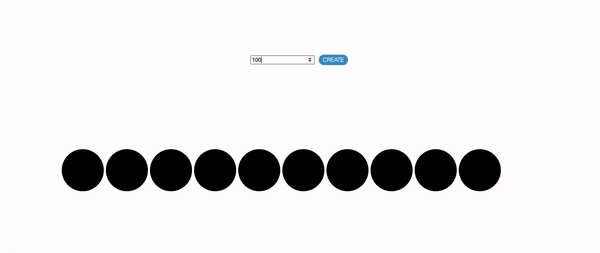
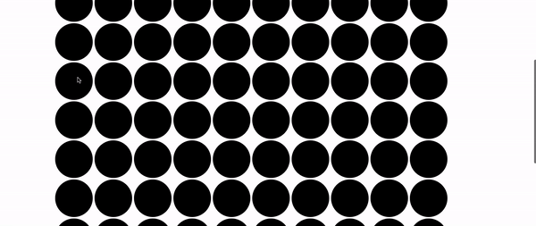

# Div UI

> Div counter UI built with JavaScript, React, and Styled Components. This user interface allows you to create multiple child divs and determine the div count when clicked on. 

## Table of Contents

1. [Demo](#demo)
2. [Development](#development)

## Demo
Create requested amount of child divs:


Horizontally aligns child divs with responsive design:



Div changes according to click:



## Development

### Installing Dependencies

From within the root directory:

```sh
npm install -g webpack
npm install
```

To make changes and recompile webpack bundle:
```sh
npm run build
```
